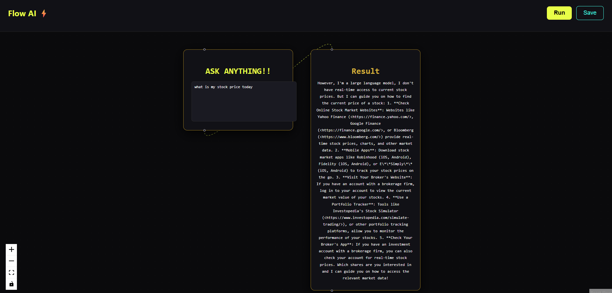

# ⚡ Flow AI - Full Stack AI Flow App

A full-stack AI-powered application where users can input a query, visualize it using a flow diagram, and get AI-generated responses. The system stores queries and responses in MongoDB.

---

## 🧠 Features

- 🟢 React Flow-based UI (visual nodes)
- ✍️ Input Node (user question)
- 📦 Result Node (AI response)
- 🔗 Connected nodes with animated edge
- 🤖 AI response using OpenRouter API
- 💾 Save query + response to MongoDB
- 🚀 Full-stack architecture (React + Node + MongoDB)

---

## 🛠️ Tech Stack

### Frontend
- React.js
- React Flow
- Axios

### Backend
- Node.js
- Express.js
- MongoDB (Mongoose)
- OpenRouter API

---

## 📂 Project Structure
project/
│
├── backend/
│ ├── main.js
│ ├── db.js
│ ├── models/
│ └── .env
│
├── frontend/
│ ├── src/
│ ├── App.js
│ └── package.json


---

## ⚙️ Setup Instructions

---

### 🔹 1. Clone the repository

```bash
git clone https://github.com/your-username/your-repo-name.git
cd your-repo-name
🔹 2. Backend Setup
cd backend
npm install
Create .env file
OPENROUTER_API_KEY=your_api_key
MONGO_URI=your_mongodb_connection_string
Run backend
node main.js

👉 Runs on:

http://localhost:5000
🔹 3. Frontend Setup
cd frontend
npm install
npm start

👉 Runs on:

http://localhost:3000
🔗 API Endpoints
🔹 Ask AI
POST /api/ask-ai

Body:

{
  "comments": "Your question"
}
🔹 Save Data
POST /api/save

Body:

{
  "question": "Your question",
  "answer": "AI response"
}
🌐 Deployment
Frontend → Vercel
Backend → Render
Database → MongoDB Atlas
🔐 Security
API keys are stored using environment variables
.env file is not pushed to GitHub
📸 Demo Flow
User Input → React Flow UI → Backend API → OpenRouter → MongoDB → Response


🥑 Author

Muskan Singh

💻 Full Stack Developer (ML + Backend)
🚀 Passionate about AI & Web Development